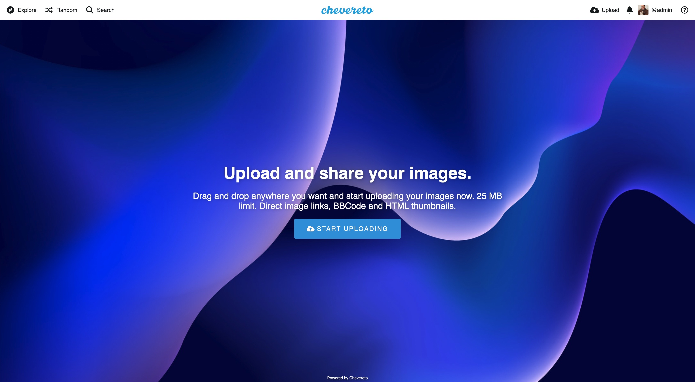

# Release 4.X

Chevereto V4 is a major quality leap, a complete modernization of Chevereto with updated coding standards and better application architecture. Everything driven by our own-made [Chevere](https://chevere.org) framework.

This release adds user-based API and turns Chevereto into a headless CMS making it usable in even more application layers and for a broad use-case.

## Video

  <iframe class="embed-responsive-item m-0" src="https://www.youtube.com/embed/C-AZVuMEFMg" frameborder="0" allow="accelerometer; autoplay; clipboard-write; encrypted-media; gyroscope; picture-in-picture" allowfullscreen></iframe>

## Screens

