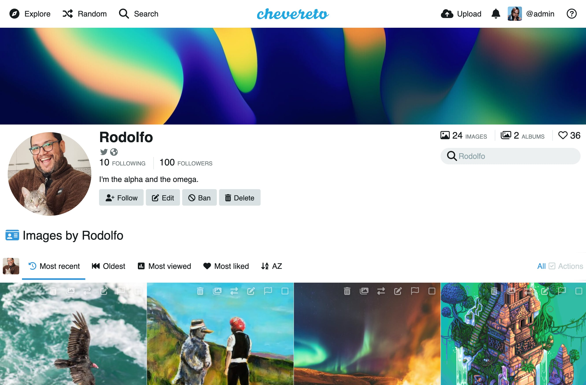
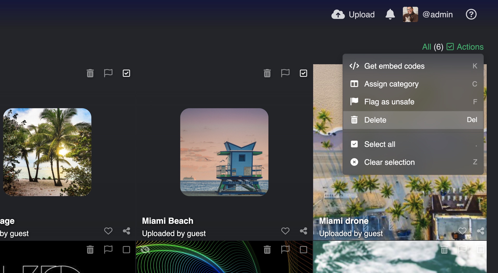
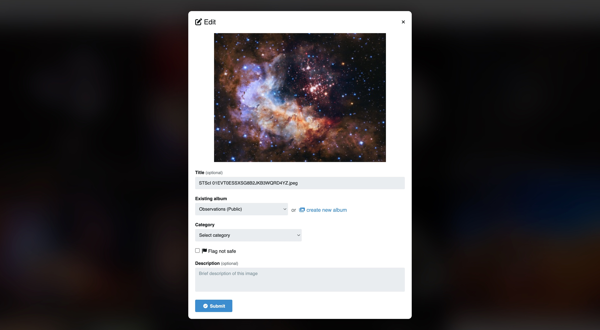

# Release 4.X

Chevereto V4 is a major quality leap, a complete modernization of Chevereto with updated coding standards and better application architecture. Everything driven by our own-made [Chevere](https://chevere.org) framework.

This release adds custom semantics, call to action buttons, user-based api, theme palettes, faster rendering, keyboard shortcuts, CSAM protection, folder upload, two-factor auth, xrDebug support, improved console, REPL, web share API, routing settings, encrypted secrets, image delete link, one-click system update, video support, configurable view for user profiles, customizable theme font, tagging system, improved storage management, AVIF image format support, system performance improvements, refined user interface and mobile experience, expanded content listing in explore, application-level cache, chunked uploads, lossless JPEG handling, support for GoPro 360 photos, Cloudflare Turnstile captcha and first-class multi-tenancy.

## Videos

### Chevereto external services

  <iframe class="embed-responsive-item m-0" src="https://www.youtube.com/embed/PljP5_-Olt4" frameborder="0" allow="accelerometer; autoplay; clipboard-write; encrypted-media; gyroscope; picture-in-picture" allowfullscreen></iframe>

### Total customization: Logos, colors, and semantics

  <iframe class="embed-responsive-item m-0" src="https://www.youtube.com/embed/JhU1XYB6Duc" frameborder="0" allow="accelerometer; autoplay; clipboard-write; encrypted-media; gyroscope; picture-in-picture" allowfullscreen></iframe>

### Chevereto Cloud is here

  <iframe class="embed-responsive-item m-0" src="https://www.youtube.com/embed/4RD9kyFeCQg" frameborder="0" allow="accelerometer; autoplay; clipboard-write; encrypted-media; gyroscope; picture-in-picture" allowfullscreen></iframe>

### Powerful image & video hosting

  <iframe class="embed-responsive-item m-0" src="https://www.youtube.com/embed/rsQuTyQTGq4" frameborder="0" allow="accelerometer; autoplay; clipboard-write; encrypted-media; gyroscope; picture-in-picture" allowfullscreen></iframe>

### Chevereto with tags, video and more

  <iframe class="embed-responsive-item m-0" src="https://www.youtube.com/embed/8o0KnTmAJTE" frameborder="0" allow="accelerometer; autoplay; clipboard-write; encrypted-media; gyroscope; picture-in-picture" allowfullscreen></iframe>

### Chevereto's get started video guide

  <iframe class="embed-responsive-item m-0" src="https://www.youtube.com/embed/vbV_u1Aw1XA" frameborder="0" allow="accelerometer; autoplay; clipboard-write; encrypted-media; gyroscope; picture-in-picture" allowfullscreen></iframe>

### Chevereto V4.0.7 - Boost community engagement

  <iframe class="embed-responsive-item m-0" src="https://www.youtube.com/embed/ClF4uCbYKdA" frameborder="0" allow="accelerometer; autoplay; clipboard-write; encrypted-media; gyroscope; picture-in-picture" allowfullscreen></iframe>

### Chevereto V4.0.6 - Semantics, call to action and more

  <iframe class="embed-responsive-item m-0" src="https://www.youtube.com/embed/TirAHdfEOR8" frameborder="0" allow="accelerometer; autoplay; clipboard-write; encrypted-media; gyroscope; picture-in-picture" allowfullscreen></iframe>

### Chevereto comparison V4 vs V3

  <iframe class="embed-responsive-item m-0" src="https://www.youtube.com/embed/ytw2Ep1Xm1A" frameborder="0" allow="accelerometer; autoplay; clipboard-write; encrypted-media; gyroscope; picture-in-picture" allowfullscreen></iframe>

### Chevereto V4 features summary

  <iframe class="embed-responsive-item m-0" src="https://www.youtube.com/embed/C-AZVuMEFMg" frameborder="0" allow="accelerometer; autoplay; clipboard-write; encrypted-media; gyroscope; picture-in-picture" allowfullscreen></iframe>

## Screens

